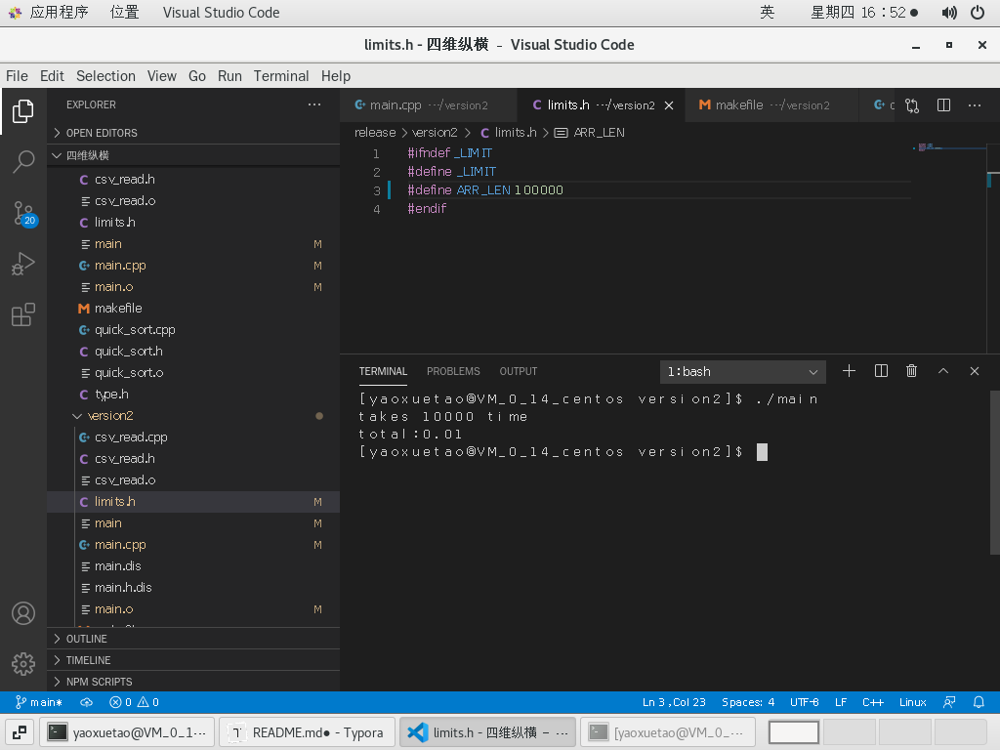

# 实现select c from foo where b<100000 order by a,b 

## 运行环境

每个文件夹都有makefile，运行在任何linux环境下都可以，我运行在centos7；注意先生成interview文件夹中的数据再运行查询程序;

运行前为了防止cpu构架不同，先make clean再make

## 目录结构

`.
├── debug
├── interview
│   ├── gendata.c
│   └── Makefile
├── mem_save_1
│   ├── csv_read.c
│   ├── csv_read.h
│   ├── csv_read.o
│   ├── limits.h
│   ├── main
│   ├── main.c
│   ├── main.dis
│   ├── main.h.dis
│   ├── main.o
│   ├── makefile
│   ├── quick_sort.c
│   ├── quick_sort.h
│   ├── quick_sort.o
│   ├── type.c
│   ├── type.h
│   └── type.o
├── photos
│   ├── a1.png
│   ├── a2.png
│   ├── image-20201203155737850.png
│   ├── image-20201203155738825.png
│   ├── image-20201203162655069.png
│   ├── image-20201203165059509.png
│   ├── image-20201203165221904.png
│   ├── image-20201203165236006.png
│   ├── image-20201203170751324.png
│   └── \345\233\233\347\273\264\347\272\265\346\250\252.png
├── README.md
├── release
│   ├── version1
│   │   ├── csv_read.cpp
│   │   ├── csv_read.h
│   │   ├── limits.h
│   │   ├── main.cpp
│   │   ├── makefile
│   │   ├── quick_sort.cpp
│   │   ├── quick_sort.h
│   │   └── type.h
│   ├── version2
│   │   ├── csv_read.cpp
│   │   ├── csv_read.h
│   │   ├── limits.h
│   │   ├── main.cpp
│   │   ├── makefile
│   │   ├── quick_sort.cpp
│   │   ├── quick_sort.h
│   │   ├── type.cpp
│   │   └── type.h
│   ├── version3
│   │   ├── csv_read.cpp
│   │   ├── csv_read.h
│   │   ├── main.cpp
│   │   ├── makefile
│   │   ├── shellsort.cpp
│   │   ├── shell_sort.h
│   │   ├── type.cpp
│   │   └── type.h
│   ├── version3_alter
│   │   ├── csv_read.cpp
│   │   ├── csv_read.h
│   │   ├── main.cpp
│   │   ├── makefile
│   │   ├── shellsort.cpp
│   │   ├── shell_sort.h
│   │   ├── type.cpp
│   │   └── type.h
│   ├── version3_singleThread
│   │   ├── csv_read.cpp
│   │   ├── csv_read.h
│   │   ├── main.cpp
│   │   ├── makefile
│   │   ├── shellsort.cpp
│   │   ├── shell_sort.h
│   │   ├── type.cpp
│   │   └── type.h
│   └── version4
│       ├── csv_read.cpp
│       ├── csv_read.h
│       ├── limits.h
│       ├── main.cpp
│       ├── makefile
│       ├── quick_sort.cpp
│       ├── quick_sort.h
│       ├── type.cpp
│       └── type.h
└── test
    ├── csv_read_test.cpp
    ├── makefile
    └── quick_sort_test.cpp`

debug目录存放debug版本，发布时已删除；release目录发布release版本，其中version1是最开始的快排，version2是改进后的快排,version3是多线程希尔排序，version4是多线程快排,version3_singleThread是单线程改进希尔排序,version3_alter是多线程改进希尔排序，目录具体内容在下面介绍。

mem_save_1实现的是内存小于1M的代码。

photos存储本文档使用的图片。

## 题目要求分析

### 题目一：实现查询功能，结果存在result.txt中，速度越快越好

分析：把数据从csv文件读出后，按a,b对数据排序即可，在开始时我想排2次，但仔细思考完全没必要，我们的目的是先比a再比b，可设计EVAL = 100000*a+b，EVAL大的排在后面即是我们希望实现的功能。

排序使用快排即可，在输出时进行b<10000的判断，如果满足才输出到结果中，即可实现功能。用计时器记录对100W数据查询的时间为

请注意上述时间仅为排序时间，读100W文件和写结果的时间是不算的，显然考察算法性能也不该计算读写IO的时间，原因：

1.select不一定要把所有数据显示给用户；

2.如果算上IO时间，排序时间将微不足道，根本看不出算法本身性能的优劣了。

这样查询10w数据需要0.09s，100W数据需要1.29s

需要注意：运行程序所需时间实际远大于1.29s，这是大文件IO导致的，耐心等待后能得到正确结果；同时打开100W的csv数据时请至少保证1G剩余内存，否则容易卡死

### 题目二：改进算法性能

题目一需要改进的其一有EVAL的比较方式，如果有多个字段需要给select的结果排序，显然EVAL这种方式是不合适的，那么可以改为分支比较，即先比a，再比b，若：

1.o1.a>o2.a 或 2.o2.a==02.a && o2.b>=02.b 则认为o1>o2即可；

其二，在最开始的快排，我们交换元素时采用原始赋值，对于有字符串的对象效率极低，因此可以改进交换方式，在version2我给数据对象新定义了交换运算符，只是交换二者拥有的数据指针，大大提高了算法效率；

查询10W条数据需要0.01s,查询100W条数据所需时间为0.16s，效率提升近10倍

其三，是否快排是最优选择？能否尝试多线程？

想到多线程，我最先想到希尔排序，因为希尔排序看起来可以分为各自并行的任务集，于是马上开始了version3代码的编写，但是编写时发现了很严重的问题：

1.希尔排序需要赋值操作，如果重载赋值符为memcpy对象的字符串，效率非常之低；

2.即便使用strcpy效率已经很低了，在间隔不同的插入排序时完全可能排到重复元素，比如：

4 8 12 16 。。。

2 4 6 8。。。

这会产生赋值时的不可重入问题，需要给赋值操作加线程锁，实验证明这需要极大的开销（如果想用多线程就要加锁，而这开销远大于多线程带来的性能提升）

对此我进行了测试，如果用多线程加锁希尔排序实现，即便1W数据查询也需要1.51s,10w数据需要的时间甚至达到了200s，根本不能接受。（这里可以看出线程锁和memcpy的开销有多大）

能否对希尔排序改进呢？我尝试了一种改进方法，即在赋值时丢弃原对象对其指针的支配权给新对象，原对象指针置null,这种方法之所以可行是因为插入排序时被丢弃的对象迟早会在后面再次被赋一个有效的值，数据不一致时暂时的。通过这样的改进查询10W数据时时间需要6s多，提高了效率，但仍然不能接受，这种改进的代码在version3_singleThread中

这种方法虽然能进行一定改进，遗憾的是无法在多线程应用，因为赋值时暂时破坏右值数据可用性破坏了并行的条件（测试代码在version3_alter中，测试后发现数据果然出现问题，出现了nullptr的字符串段）

最后我尝试了多线程快排，我只使用了2个线程，原因有：

1.我的服务器只有2核；

2.当用数组抽象创建线程的pid，就需要用线程锁保证数据一致性，这在上面已经看到了是多不划算的开销

3.对于快排，6个线程只能保证4的并行度，而线程数为2则能保证并行度为2不浪费线程资源

然而发现测试后效率几乎没有提升，与version2所需时间基本一模一样，我估计原因有：

1.我的服务器核太少了，不能保证2线程真的并行调度；

2.快排太快了，可能创建线程本身的开销比排序少不了很多。

总之，通过以上尝试，单线程快排效率最优最合适，查询100W数据如果只算查询时间只需要0.15s左右，代码为releas/version2中的代码。

### 题目3 十万数据内存使用量小于1M

实现这个问题有难度，如果用version2中的代码，用top命令发现内存用量在100M，分析：主要内存消耗在于对象需要一个1024字节的字符堆空间，我采取了一种压缩算法：设置长度为10W的数组，第i个元素记录第i行的文件位置，这样对象的字符空间可以用索引代替，索引表示对象在第几行。传进快排后，输出时需要读出索引数组中存储的pos，在该pos直接从磁盘读出数据写到输出中。这样改进后内存占用大大减小，但仍然有1.8M多的空间，即便把数组缩小为1000也有1.3M，可见多次读取不能解决问题，分析后发现原因是：

1.C++库运行时会构建很多没必要的对象，它们非常占用内存，因此我把编码改为了C；

2.文件缓冲区也算在了程序内存占用中，因此我把内存缓冲区设置为nullptr。

这样修改后，内存占用量降到了600K，满足需求。

但是要说明：

1.由于不要文件缓冲还要随即读取文件，程序非常慢，这不是排序的原因，看输出排序仍然只有0.01s，原因在于文件IO非常非常慢，可以运行到3min(但是实际情况下，select并不需要输出这么多的数据到文件中，终端中居多；而且如果文件设置缓冲能大大加快运行速度，内存占用也小于2M，这里是为了实现题目要求)

2.在快排完成后看top命令，内存涨到了1.3M，我认为这不是程序的问题，因为快排后使用的所有内存我确定都会被释放，我推测是top把运行的所有堆栈加到开销中，在堆栈空间被释放时却不减去这部分开销，这很可能是top统计数据的问题；

## 测试

在release的每个版本中都做了回归测试，除了version3_alter是为了证明希尔排序的改进无法用多线程实现外；

在test包中做了模块测试，包括：

1.csv_read模块的测试

2.quick_sort模块的测试

其他的模块测试都集成在了回归测试中
